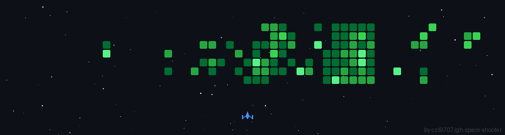

<div align="center">

# **SUCHET RANA**

[](https://git.io/typing-svg)

[](https://www.linkedin.com/in/suchetrana/)
[](mailto:suchet.rana.dev@gmail.com)
[](https://github.com/suchetrana)
[](https://leetcode.com/suchetrana)


[](https://github.com/suchetrana?tab=repositories)
[](https://github.com/suchetrana?tab=followers)

</div>

---

## 👨‍💻 **PROFESSIONAL SUMMARY**

<table>
<tr>
<td width="60%">

**Backend Software Engineer** with expertise in building **high-performance, scalable systems** using **Java** and **Node.js**. Strong foundation in **Data Structures & Algorithms**, **System Design**, and **Cloud Architecture**. Passionate about writing clean, maintainable code that solves complex problems and delivers exceptional user experiences.

### 🎯 **Current Focus:**
- 🔭 Building robust backend systems and RESTful APIs
- 🌱 Mastering distributed systems and microservices architecture
- 💡 Contributing to open-source projects
- 📚 Deepening expertise in cloud-native technologies (AWS)
- 🚀 Exploring advanced system design patterns

### 💼 **Core Values:**
```java
String[] principles = {
    "Clean Architecture",
    "Performance Optimization", 
    "Scalable Solutions",
    "Continuous Learning"
};
```

</td>
<td width="40%">


### 📊 **Quick Stats:**
- 💻 18+ Active Repositories
- ⭐ Growing Open Source Contributor
- 🎓 Strong DSA Foundation
- ☁️ AWS Cloud Practitioner
- 🔧 Full Stack Capabilities

</td>
</tr>
</table>

---

## 🛠️ **TECH STACK**

<div align="center">

### 💻 **Programming Languages**


---

### 🎨 **Frontend Development**


---

### ⚙️ **Backend, Frameworks & APIs**


---

### 🗄️ **Databases & Caching**


---

### ☁️ **Cloud & DevOps**


---

### 🔧 **Development Tools & Version Control**


---

### 📚 **Core Computer Science**


</div>

---

## 🚀 **FEATURED PROJECTS**

<div align="center">

| 🎯 **Project** | 📝 **Description** | 🛠️ **Tech Stack** | 🔗 **Links** |
|:---:|:---:|:---:|:---:|
| **DSA Mastery** | Comprehensive Data Structures & Algorithms implementations | Java, C++, Problem Solving | [View →](https://github.com/suchetrana/DSA-SUCHET) |
| **Advanced Java** | Advanced Java concepts and design patterns | Java, OOP, Design Patterns | [View →](https://github.com/suchetrana/Advanced-Java-Code) |
| **Backend Development** | Full-stack backend development projects | Node.js, Express, MongoDB, PostgreSQL | [View →](https://github.com/suchetrana/Backend-Development-5th-Sem) |
| **JavaScript Mastery** | Modern JavaScript implementations & projects | JavaScript, ES6+, Async Programming | [View →](https://github.com/suchetrana/JavaScript) |

</div>

<div align="center">

[](https://github.com/suchetrana?tab=repositories)

</div>


## 💡 **CODING PHILOSOPHY**

<div align="center">

<table>
<tr>
<td width="50%">

```java
public class SoftwareEngineer {
    private String name = "Suchet Rana";
    private String role = "Backend Engineer";
    private String[] expertise = {
        "Java", "Node.js", "System Design"
    };
    
    private String[] values = {
        "Clean Code",
        "Scalable Architecture",
        "Performance Optimization",
        "Continuous Learning"
    };
    
    public void dailyRoutine() {
        while (isGrowing) {
            learn();
            code();
            optimize();
            document();
            share();
        }
    }
    
    public String getMotto() {
        return "Build it right, build it scalable!";
    }
}
```

</td>
<td width="50%">

### 🎯 **Problem-Solving Approach:**
```plaintext
┌─────────────────────────────────┐
│  1. Understand the Problem      │
│  2. Break it Down               │
│  3. Design the Solution         │
│  4. Implement Clean Code        │
│  5. Optimize Performance        │
│  6. Test Thoroughly             │
│  7. Document & Refactor         │
└─────────────────────────────────┘
```

### 💭 **Philosophy:**
> *"First, solve the problem. Then, write the code."*
> 
> *"Make it work, make it right, make it fast."*
>
> *"Code is read more than it's written."*

</td>
</tr>
</table>

</div>

---

## 🎓 **SKILLS & EXPERTISE**

<div align="center">

| 🔹 **Category** | 🔹 **Skills** |
|:---|:---|
| **Backend Development** | Java, Node.js, Express.js, Spring Boot, RESTful APIs, Microservices |
| **Database Management** | PostgreSQL, MongoDB, MySQL, Redis, Database Design & Optimization |
| **Frontend Technologies** | HTML5, CSS3, JavaScript, React.js, Responsive Design |
| **Cloud & DevOps** | AWS (EC2, S3, Lambda), Docker, CI/CD, GitHub Actions |
| **Core CS Fundamentals** | Data Structures, Algorithms, System Design, OOP, Design Patterns |
| **Version Control** | Git, GitHub, Collaborative Development, Code Reviews |
| **Programming Languages** | Java, JavaScript, Python, C++, C, SQL |
| **Development Tools** | VS Code, IntelliJ IDEA, Postman, Linux/Unix |

</div>

---

## 🌟 **WHAT I BRING TO THE TABLE**

<div align="center">

```ascii
╔═══════════════════════════════════════════════════════════════╗
║                                                               ║
║  ✅  Strong foundation in Data Structures & Algorithms       ║
║  ✅  Experience in building scalable backend systems         ║
║  ✅  Proficiency in Java and Node.js ecosystems              ║
║  ✅  Understanding of system design principles               ║
║  ✅  Cloud computing knowledge (AWS)                         ║
║  ✅  Clean code and best practices advocate                  ║
║  ✅  Problem-solving mindset with analytical thinking        ║
║  ✅  Continuous learner and technology enthusiast            ║
║                                                               ║
╚═══════════════════════════════════════════════════════════════╝
```

</div>

---
<p align="center">
  
</p>


## 📬 **LET'S CONNECT**

<div align="center">

### 💼 **Open to opportunities in:**
- Backend Software Engineering
- Full Stack Development
- System Design & Architecture
- Open Source Contributions
- Tech Collaborations

### 📫 **Reach Out:**

[](https://www.linkedin.com/in/suchetrana/)
[](mailto:suchet.rana.dev@gmail.com)
[](https://github.com/suchetrana)
[](https://portfolio-part-2-dun.vercel.app/)

### 💬 **Available for:**
`Backend Development` • `System Design Discussions` • `Code Reviews` • `Tech Mentorship` • `Open Source Collaboration`

</div>

---

<div align="center">

### ⭐ **"Turning ideas into scalable reality, one commit at a time."**


**If you find my work interesting, consider giving it a ⭐!**

</div>

---

<div align="center">

*Last Updated: February 2026*
</div>
